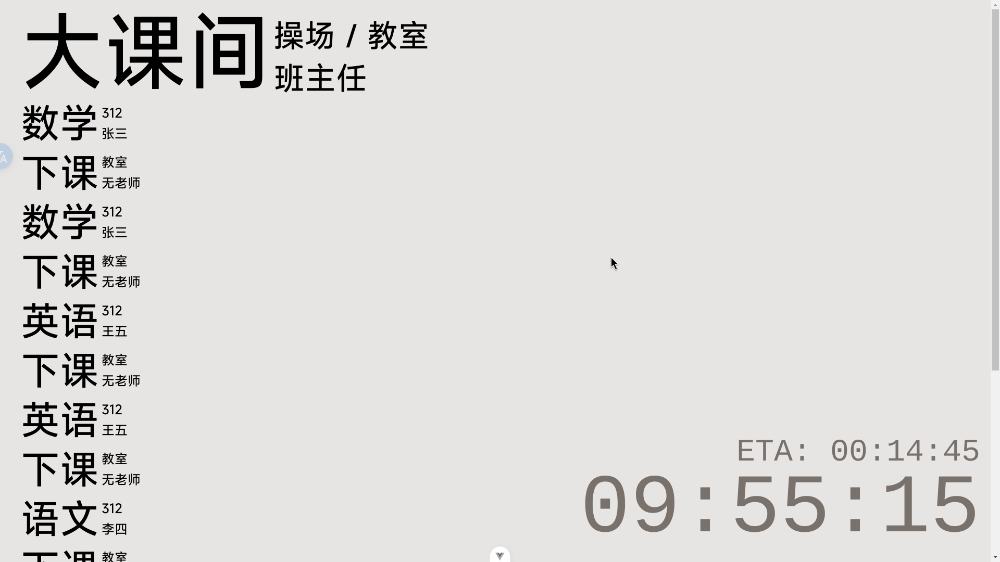

# simple class

一个基于网页的简易课表

## 使用方法

1. git clone 本项目 `git clone https://github.com/pizerolol/simple-class --depth=1`
2. 使用 [cses 编辑器](https://edit.cses-org.cn/) 创建 json 课表
3. 将 json 课表粘贴到本项目根目录下的 `cses.json`
4. 修改 `config.json` 设置开学日期
5. 下载 nodejs 环境，进入 [官网](https://nodejs.org/zh-cn) 点击 `下载 Node.js (LTS)`
6. 下载 pnpm `npm i -g pnpm`
7. 下载依赖 `pnpm i`
8. 构建 `pnpm build`
9. 拿着 dist 目录下的网页用任意一个服务器部署，如使用 python 3 自带的 http.server `python -m http.server`
10. 打开网页
